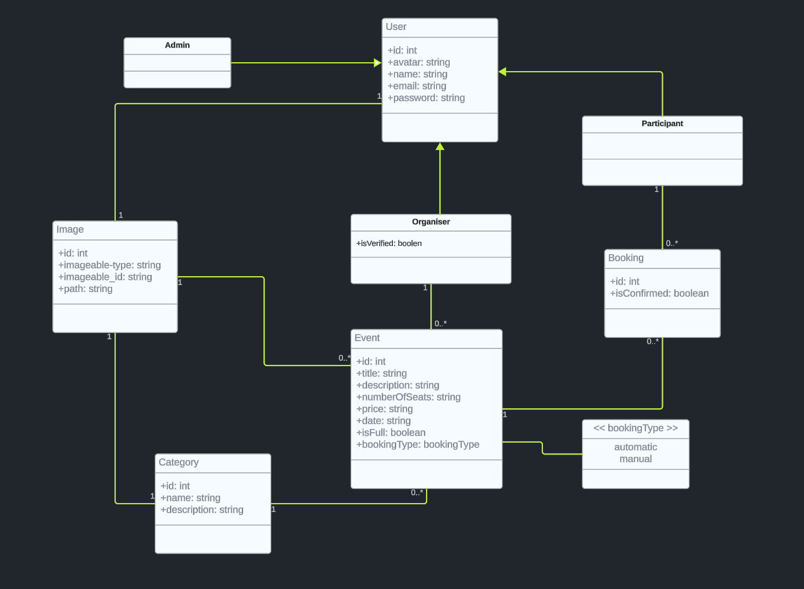
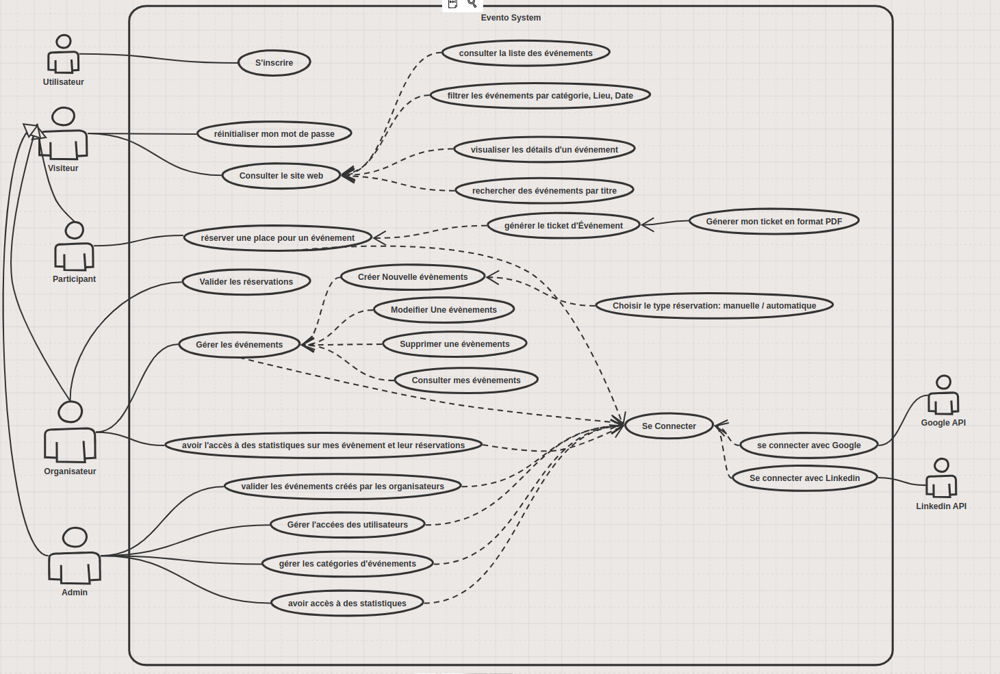

#  Evento: Gestion et Réservation des Places d'Événements

## Nous visons à devenir la référence en tant que principal fournisseur de solutions innovantes pour la gestion et la réservation d'événements.


Notre objectif est de développer une plateforme intuitive qui simplifie la gestion et la réservation d'événements, offrant une expérience exceptionnelle à tous les utilisateurs.

## Jira Planification Link
https://aymaneelmaini.atlassian.net/jira/software/projects/EV/boards/20
## Presentation Link
https://www.canva.com/design/DAF_HWRTon4/Q-xrfSMzmx944I2rGyX0Qg/edit
## Repository Link
https://github.com/AymaneTech/evento


Clone the project repository:

```bash
$ git clone git@github.com:AymaneTech/Evento.git
```
```bash
$ cd evento
```
```bash
$ docker run --rm \
    -u "$(id -u):$(id -g)" \
    -v "$(pwd):/var/www/html" \
    -w /var/www/html \
    laravelsail/php83-composer:latest \
    composer install --ignore-platform-reqs
```

run the migration

```run project
$ ./vendor/bin/sail artisan migrate && ./vendor/bin/sail db:seed
```


run the project

```run project
$ ./vendor/bin/sail up -d
```


## Conception

Diagramme de Classes.





## Access to Dshboard  
| Email             | Passwoed | 
|:------------------|:--------:|
| `admin@gmail.com` |   123    |
